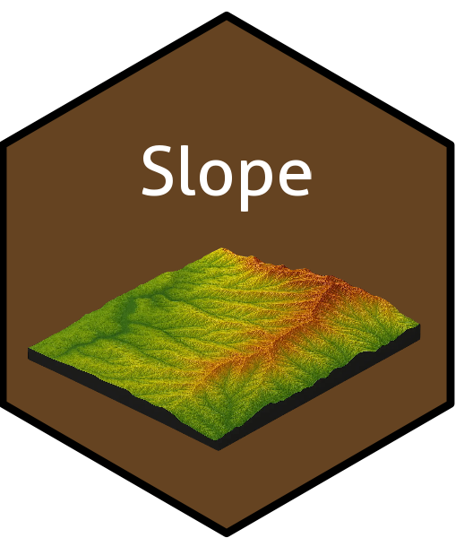

## slope: Identify Slope Patterns and Processes

O pacote `slope` fornece diferentes abordagens geomorfométricas para detecção de padrões de formas de encostas e dinâmica de fluxos de detritos baseados em Modelos Digitais de Elevação (MDE).

#### Install:
```R
remotes::install_github("marquesfilhojp/slope")
