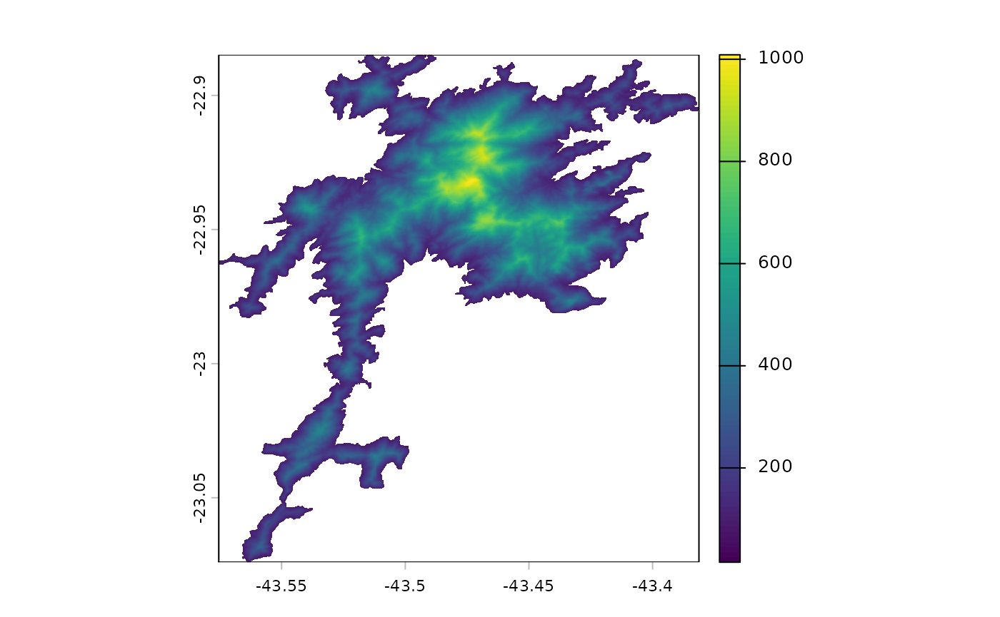

# Open Topography Global Datasets

``` r

library(pacman)
p_load(sf, slope)
aoi <- sf::read_sf("dem/aoi.shp")
api_key <- 'b1698eb31759cfb304e80f31650e1a99'
dem <- tempfile(fileext = ".tif")
data <- slope::elevr('GEDTM30', aoi, api_key, dem)
plot(data)
```


