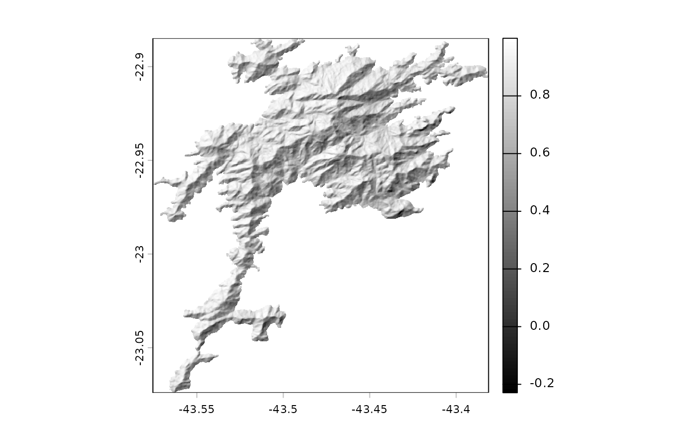
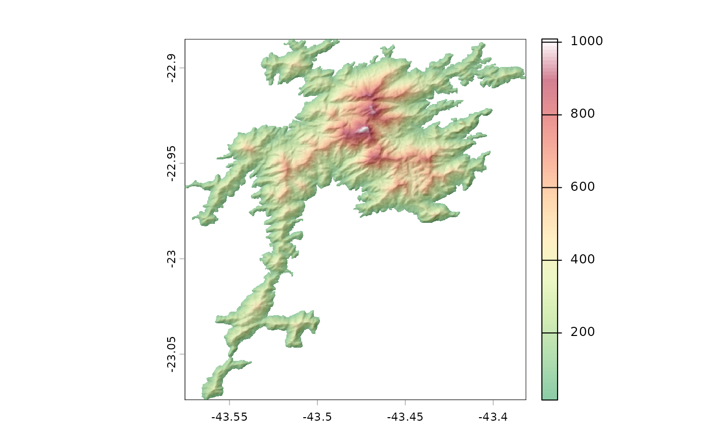

# Hillshade

``` r

library(pacman)
p_load(sf, slope)
aoi <- sf::read_sf('dem/aoi.shp')
api_key <- '9067bc3f7cb2d4565e8a0cdd42818c03'
dem <- tempfile(fileext = '.tif')
data <- slope::elevr('GEDTM30', aoi, api_key, dem)
shade <- slope::hillshade(data, 3, 45, 315)
plot(shade, col = grey(c(0:100)/100), maxcell = Inf, smooth = F)
```



``` r

library(pacman)
p_load(sf, slope)
aoi <- sf::read_sf('dem/aoi.shp')
api_key <- '9067bc3f7cb2d4565e8a0cdd42818c03'
dem <- tempfile(fileext = '.tif')
data <- slope::elevr('GEDTM30', aoi, api_key, dem)
shade <- slope::hillshade(data, 3, 45, 315)

pal <- colorRampPalette(c("#1A9850", 
                          "#66BD63", 
                          "#A6D96A",
                          "#D9EF8B",
                          "#FEE08B",
                          "#FDAE61",
                          "#F46D43",
                          "#D73027",
                          "#A50026", 
                          "#FFFFFF"))

plot(shade, col = grey(c(0:100)/100), legend = F, maxcell = Inf, smooth = F)
plot(data, col = pal(100), alpha = 0.5, add = T)
```


